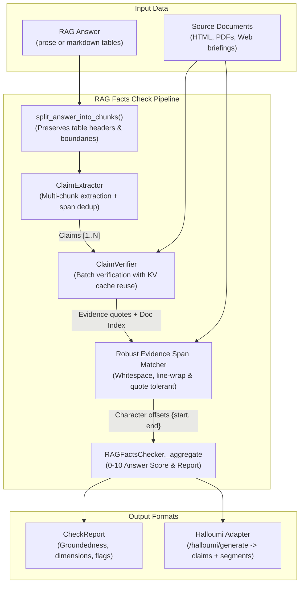
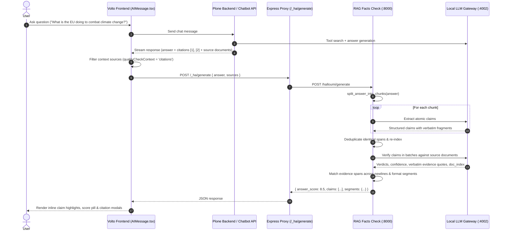

# RAG Facts Check

A modular, high-performance system for verifying RAG-generated answers against their source documents using claim extraction, targeted evidence retrieval, and per-claim verification.

Designed as a drop-in replacement for legacy verification backends (such as Halloumi), it integrates seamlessly with the EEA Chatbot frontend (`volto-eea-chatbot`).

---

## Architecture Overview



---

## End-to-End Integration Flow

The service acts as the verification backbone for the EEA Chatbot in Plone/Volto:



---

## Key Capabilities

### 1. Chunked Claim Extraction for Long Answers & Tables
- **The Challenge:** Long answers (>2,000 characters), especially markdown tables with 8+ rows and concluding sections, exceed the LLM output token limit when extracted in a single pass.
- **The Solution:** [`split_answer_into_chunks()`](rag_facts_check/checker.py) parses markdown tables, keeps row integrity, replicates table headers into every split chunk so column context is retained, and merges short headers/summaries.
- All extracted claims are aggregated, deduplicated by verbatim text spans in the answer, and re-indexed.

### 2. Robust Multi-Strategy Evidence Span Matching
- **The Challenge:** Scraped documents (PDFs, web pages) have hard linebreaks (`\n`), irregular whitespace, and formatting artifacts. LLMs frequently add quotes or ellipses when citing evidence.
- **The Solution:** [`find_evidence_span_in_doc()`](rag_facts_check/spans.py) runs a resilient 4-stage matching algorithm:
  1. **Quote & Ellipsis Stripping:** Cleans surrounding straight (`"`, `'`), smart (`“`, `”`), and bracketed quotes.
  2. **Exact Match:** Instant offset matching when verbatim text matches.
  3. **Whitespace-Flexible Regex (`\s+`):** Matches single-line quotes against documents with line breaks.
  4. **Punctuation & Word-Boundary (`[\W_]+`):** Matches text across hyphenation and punctuation variations.
  5. **Fuzzy Sequence Alignment:** Fallback to `SequenceMatcher` for minor paraphrasing.

### 3. Answer Quality Score (0–10)
- Aggregates per-claim verdicts into an interpretable 0–10 score:
  - **Groundedness Base:** Supported claims count for 1.0, unverified claims count for 0.4.
  - **Citation Penalty:** Up to 30% reduction if supported claims fail to cite source text.
  - **Contradiction Penalty:** Harsh reduction when claims contradict source documents.

### 4. Batch Verification with KV-Cache Prefix Reuse
- When `batch_size > 1` (default: 20), claims are grouped into batches.
- Static documents are placed before claims in the prompt, allowing backends like `llama.cpp` and `vLLM` to reuse pre-computed KV caches for massive speedups.

---

## Quick Start

### Installation

```bash
# Clone the repository
git clone git@github.com:eea/rag-facts-check.git
cd rag-facts-check

# Create virtual environment and install dependencies
python3 -m venv .venv
source .venv/bin/activate
pip install -e ".[test,dev,server]"
```

### Configuration (`.env`)

Create a `.env` file in the root directory:

```bash
LLM_API_BASE=http://localhost:4002/v1
LLM_API_KEY=sk-litellm-master-key
LLM_MODEL=gemma
LLM_TEMPERATURE=0.1
```

### Running the Web Service

```bash
# Development server with auto-reload
make serve

# Or run directly via uvicorn
uvicorn rag_facts_check.server:app --reload --host 0.0.0.0 --port 8000
```

### Production Docker

```bash
docker build -t rag-fact-check .
docker run -p 8000:8000 -e LLM_API_BASE=http://host.docker.internal:4002/v1 rag-fact-check
```

---

## API Endpoints

### `POST /halloumi/generate`
Drop-in replacement for the Halloumi middleware used by `volto-eea-chatbot`.

- **Request:**
  ```json
  {
    "answer": "The European Climate Law sets a binding net-zero target by 2050.",
    "sources": [
      {
        "title": "European Climate Law",
        "text": "The European Climate Law sets a binding target to achieve climate neutrality by 2050.",
        "source_type": "web",
        "link": "https://eur-lex.europa.eu/..."
      }
    ],
    "batch_size": 20
  }
  ```
- **Response:**
  ```json
  {
    "answer_score": 9.5,
    "claims": [
      {
        "claimString": "The European Climate Law sets a binding net-zero target by 2050.",
        "startOffset": 0,
        "endOffset": 64,
        "segmentIds": ["0"],
        "score": 1.0,
        "rationale": "Document confirms this explicitly.",
        "skipped": false
      }
    ],
    "segments": {
      "0": {
        "id": 0,
        "startOffset": 0,
        "endOffset": 89
      }
    }
  }
  ```

### `POST /check`
Full RAG fact-checking endpoint returning detailed analytical dimensions, hallucination flags, and per-claim verdicts.

### `GET /health`
Returns service status and version (`{"status": "ok", "version": "0.2.0"}`).

---

## Testing

The project includes an extensive test suite covering chunking, claim deduplication, span alignment, retrieval, and FastAPI endpoints.

```bash
# Run pytest
pytest

# Run with test coverage
pytest --cov=rag_facts_check

# Run linter
ruff check tests/ rag_facts_check/
```

- **Current Status:** 190 tests passing (100% pass rate).
- **Core Coverage:** 87% on `checker.py`, 88% on `spans.py`, 95% on `retriever.py`, 100% on `models.py`.

---

## Documentation Index

Full documentation is available in [`docs/`](docs/index.md):

- **[Project Overview](docs/overview/overview.md)** — Core goals, challenges, and architecture
- **[System Architecture](docs/architecture/architecture.md)** — Module layout and component responsibilities
- **[Data Flow & Lifecycle](docs/architecture/data-flow.md)** — Step-by-step pipeline, sequence diagrams, and span mapping
- **[Answer Quality Score](docs/architecture/answer-quality-score.md)** — Scoring formula, weights, and calibration
- **[Web Service Guide](docs/guides/web-service.md)** — Endpoints, request schemas, and integration examples
- **[Testing Guide](docs/guides/testing.md)** — Test suite layout, fixtures, and coverage

---

## License

MIT License. Developed for the European Environment Agency (EEA).
