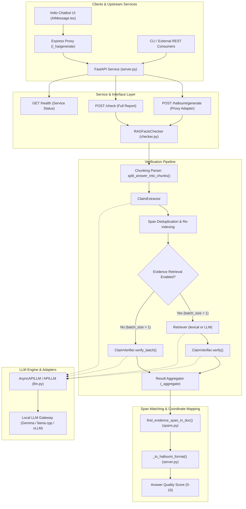

# System Architecture

RAG Facts Check provides fine-grained, claim-level fact verification for retrieval-augmented generation (RAG) applications. It acts as both a full analytical verification engine and a drop-in proxy replacement for Halloumi within the European Environment Agency (EEA) chatbot ecosystem.

---

## Component Architecture



---

## Module Layout

```
rag_facts_check/
├── __init__.py       # Package exports and version metadata
├── models.py         # Dataclasses: Claim, VerificationResult, CheckReport, Span, score_label
├── llm.py            # Abstract LLM base + adapters (HuggingFace, API, Chat, AsyncAPI)
├── prompts.py        # Prompts for claim extraction, batch verification, and multi-step reasoning
├── retriever.py      # Evidence retrieval (lexical overlap + LLMEvidenceRetriever)
├── spans.py          # 4-stage robust span matching (claim -> answer, evidence -> document)
├── checker.py        # Core pipeline: Chunking, ClaimExtractor, ClaimVerifier, Aggregator
└── server.py         # FastAPI web service (POST /check, POST /halloumi/generate, GET /health)
```

```
tests/
├── conftest.py              # Shared pytest fixtures (mock_llm, AsyncMock helpers, live_llm)
├── mocks/                   # Mock payloads and LLM responses
├── test_models.py           # Dataclass serialization, score_label, and validation tests
├── test_retriever.py        # Lexical and semantic retrieval tests
├── test_checker.py          # Core pipeline, chunked extraction, deduplication, and aggregation tests
├── test_halloumi_adapter.py # Halloumi request/response format conversion tests
├── test_spans.py            # Exact, regex, whitespace, and fuzzy span alignment tests
├── test_server.py           # FastAPI endpoint tests via Starlette TestClient
└── test_integration.py      # End-to-end pipeline verification tests
```

---

## Core Components

### 1. `checker.py` — Pipeline Orchestration

The core module coordinates the lifecycle from raw answer to verified claims:

- **`split_answer_into_chunks(answer, max_chunk_chars=2000)`**:
  Decomposes long answers into manageable pieces without breaking semantic integrity:
  - Preserves markdown tables intact when possible.
  - If a table exceeds the limit, splits by rows while **replicating table headers** across each chunk so LLMs retain column context.
  - Merges short sections (like introductory or concluding paragraphs) to maintain adequate context.
- **`ClaimExtractor`**:
  Extracts atomic factual claims using structured JSON prompts:
  - Submits chunks to the LLM and parses claims with exact verbatim fragments (`original_text`).
  - Resolves character offsets (`Span(start, end)`) against the original master answer.
  - Applies multi-turn refinement (up to 3 rounds) if a verbatim fragment cannot be directly located.
  - Deduplicates claims sharing identical character spans to eliminate repetitive assertions.
- **`ClaimVerifier`**:
  Verifies each claim against source documents:
  - **Sequential Mode (`batch_size=1`)**: Evaluates claims individually with optional multi-step evidence-first prompting or self-consistency majority voting across temperature runs.
  - **Batch Mode (`batch_size > 1`, default: 20)**: Groups up to $N$ claims into a single verification request. Positions static documents first to leverage **KV cache prefix reuse** in backends like `llama.cpp`.
  - Captures `document_index` alongside evidence quotes to guarantee accurate document attribution.
- **`RAGFactsChecker._aggregate`**:
  Synthesizes per-claim verdicts into a `CheckReport`:
  - Calculates groundedness, contradiction rate, and hallucination rate.
  - Computes the calibrated 0–10 `answer_score`.
  - Aggregates hallucination flags and human-readable summaries.

### 2. `spans.py` — Resilient Evidence Span Matching

Maps LLM-generated evidence quotes back to exact character offsets in source documents. Web-scraped content and PDF extractions frequently contain hard line breaks, irregular whitespace, and formatting artifacts.

[`find_evidence_span_in_doc()`](file:///home/tibi/work/rag-fact-check/rag_facts_check/spans.py) executes a 4-stage matching hierarchy:
1. **Quote & Ellipsis Stripping**: Strips leading/trailing straight quotes (`"`, `'`), smart quotes (`“`, `”`, `«`, `»`), backticks, and ellipses (`...`, `…`).
2. **Exact Matching**: Searches verbatim with `text.find()`.
3. **Whitespace-Flexible Regex (`\s+`)**: Collapses internal whitespace in the quote into `\s+` to seamlessly match across line breaks.
4. **Punctuation & Word-Boundary (`[\W_]+`)**: Replaces non-word characters with regex patterns to tolerate hyphenation, em-dashes, and quotation variations.
5. **Fuzzy Sequence Alignment**: Uses Python's `difflib.SequenceMatcher` as a final fallback with a configurable similarity threshold (default: 0.85).

### 3. `models.py` — Structured Data Models

- **`Span`**: Character-level `{start, end}` boundaries.
- **`Claim`**: Represents an atomic assertion with `index`, `text`, `original_text`, and `span`.
- **`VerificationResult`**: Contains `verdict`, `confidence`, `evidence`, `explanation`, `document_index`, and `evidence_span`.
- **`CheckReport`**: Final report containing `answer_score`, `overall_confidence`, `overall_verdict`, `dimensions`, `claims`, and `hallucination_flags`.
- **`score_label(score)`**: Helper function classifying 0–10 scores into qualitative categories: `Excellent` (9–10), `Good` (7–8), `Acceptable` (5–6), `Poor` (3–4), `Failing` (1–2), and `No claims` (0).

### 4. `server.py` — Web Service & Halloumi Adapter

Exposes an asynchronous FastAPI application:
- **`POST /halloumi/generate`**: Acts as a drop-in replacement for the legacy Halloumi container. Accepts `{answer, sources, batch_size}` and converts internal `CheckReport` results into Halloumi-compliant schema `{answer_score, claims, segments}`.
- **`POST /check`**: Comprehensive fact-checking endpoint returning the complete `CheckReport`.
- **`GET /health`**: Readiness and liveness endpoint returning service status and version.

### 5. `llm.py` — LLM Communication Adapters

Abstracts the LLM client layer:
- **`AsyncAPILLM`**: Default async HTTP client for OpenAI-compatible completion endpoints (LiteLLM, vLLM, llama.cpp).
- **`APILLM`**: Synchronous HTTP client.
- **`ChatLLM`**: Chat-completion endpoint adapter.
- **`HuggingFaceLLM`**: In-process adapter using Hugging Face `transformers`.
