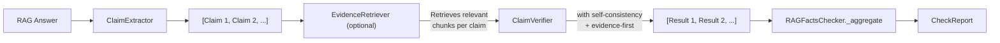

# Data Flow

## Pipeline Overview

## Step-by-Step

### 1. Claim Extraction

The answer text is sent to the LLM with a claim extraction prompt (2048 token budget). The LLM returns a structured list of atomic factual claims. Each claim is parsed into a `Claim` object with:

- `index` — position in the extracted list
- `text` — the claim string
- `original_text` — exact verbatim fragment from the answer (for span matching)
- `span` — `{start, end}` character offsets in the original answer

Claims with identical spans are deduplicated (the LLM sometimes extracts the same fact twice). Multi-turn refinement (up to 3 rounds) fixes claims whose `original_text` cannot be located in the answer.

### 2. Evidence Retrieval (default: enabled)

If `use_evidence_retrieval=True` (the default), documents are split into chunks and the most relevant chunks are retrieved for each claim. By default, `LLMEvidenceRetriever` uses the LLM to judge semantic relevance (more accurate than keyword matching). When `batch_size > 1`, this step is skipped — batch verification sends all documents directly.

### 3. Claim Verification

Claims are verified against the source documents (or retrieved chunks). Two modes are available:

**Sequential mode** (`batch_size=1`, default): Each claim is verified individually.

  - The LLM is prompted with the claim + relevant document text. When documents carry `title` metadata, titles appear as headers in the prompt (e.g. `Document 1: Europe's environment 2025`) without polluting the raw text (preserving span offsets).
  - If `evidence_first=True`, the prompt uses a multi-step format (extract evidence → compare → verdict → output)
  - If `num_consistency_runs > 1`, verification runs multiple times with increasing temperatures and results are aggregated via majority vote
  - Output is parsed into a `VerificationResult` with verdict, confidence, evidence, explanation, and optional `consistency_score`
  - Evidence spans are computed by searching for the LLM's verbatim evidence quote in the source documents. Zero-length or unmatched spans are skipped (no bogus highlights).

**Batch mode** (`batch_size > 1`): Claims are grouped into batches of N. Each batch sends all documents once plus all claims in the batch as a single LLM call. The LLM returns a JSON array of verdicts. Batch mode skips evidence retrieval — all documents are sent directly, benefiting from KV cache reuse.

### 4. Aggregation

`RAGFactsChecker._aggregate` combines all `VerificationResult` objects into a single `CheckReport`:

- **`overall_confidence`** — weighted average of per-claim confidence scores
- **`overall_verdict`** — derived from the distribution of per-claim verdicts
- **`dimensions`** — groundedness, contradiction rate, hallucination rate, completeness
- **`hallucination_flags`** — claims that are contradicted or lack evidence
- **`summary`** — human-readable summary text

See [Output Format](output-format.md) for the full `CheckReport` schema.
