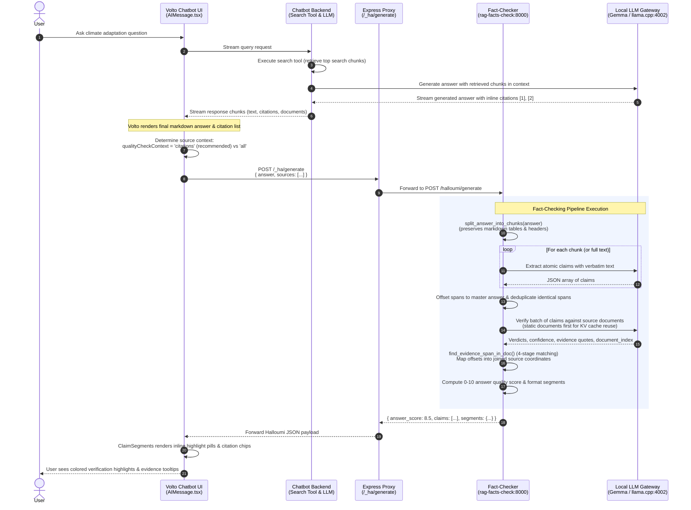
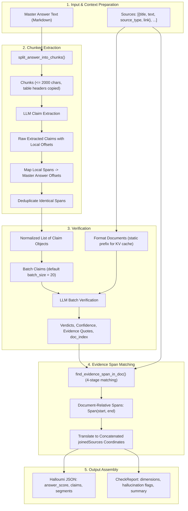
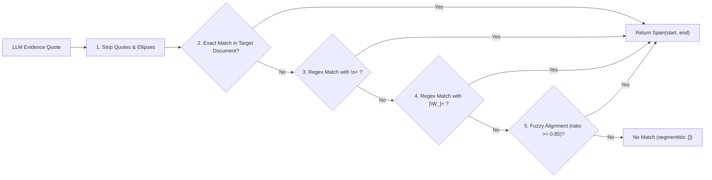

# Data Flow and Lifecycle

This document details the end-to-end data lifecycle: from the user asking a question in the EEA Chatbot, through search retrieval and answer generation, to claim extraction, batch verification, evidence span alignment, and frontend rendering.

---

## End-to-End Sequence Flow

The diagram below traces the complete communication flow across the EEA Chatbot stack:



---

## Pipeline Data Transformations

The pipeline transforms raw answer and source text through five distinct stages:



---

## Step-by-Step Breakdown

### 1. Source Context Selection (`qualityCheckContext`)

In `volto-eea-chatbot`, the chatbot answer includes metadata about available documents. The frontend block configuration allows selecting between two modes:

| Mode | Documents Passed | Typical Payload Size | LLM Verification Speed | Grounding Alignment |
|---|---|---|---|---|
| **`citations`** *(Recommended)* | Only documents explicitly cited in the answer (e.g., `[1]`, `[2]`) | ~20–35 KB (2–4 docs) | **Fast (5–12s)** | Matches the exact context used by the generation model |
| **`all`** | All search results and tool responses returned during retrieval | ~100–250 KB (15–50 docs) | **Slow (30–90s+)** | Passes documents the generation model never saw, increasing prompt prefill overhead |

When `qualityCheckContext: 'citations'` is enabled, prompt prefill latency on local models (`llama.cpp`, `vLLM`) decreases by >70%, and verification accuracy improves because unconsulted documents are not evaluated.

---

### 2. Chunked Claim Extraction

#### The Problem
When chatbot answers exceed ~2,500 characters—particularly structured responses with markdown comparison tables and concluding summaries—a single LLM extraction pass with `max_new_tokens = 2048` truncates early. This leaves tables partially verified and concluding sections completely unverified.

#### The Solution: `split_answer_into_chunks()`
1. **Markdown Table Parsing**:
   - Detects markdown table boundaries (`| Header 1 | Header 2 |` followed by `|---|---|`).
   - If a table fits within the character budget (default: 2,000 chars), it is kept intact.
   - If a table exceeds the limit, it is split row by row while **re-injecting the header rows into each chunk**. This ensures the LLM understands column semantics for every row.
2. **Short Section Merging**:
   - Short markdown sections (headings, lead paragraphs) are grouped together to provide sufficient context for claim extraction.
3. **Span Recalibration**:
   - Each chunk tracks its `offset` relative to the master answer.
   - When claims are extracted, character spans are mapped back:
     $$\text{master\_start} = \text{offset} + \text{local\_start}$$
     $$\text{master\_end} = \text{offset} + \text{local\_end}$$
4. **Span Deduplication**:
   - Claims sharing identical `{start, end}` boundaries in the master answer are deduplicated.
   - All claims are re-indexed consecutively (`1, 2, ..., N`).

---

### 3. Claim Verification & KV Cache Prefix Reuse

#### Sequential Mode (`batch_size = 1`)
- Each claim is verified individually against source text.
- Optional features:
  - **Evidence-First Prompting**: The model first quotes verbatim evidence, reasons about consistency, and then outputs a verdict.
  - **Self-Consistency**: Verification runs multiple times with varying temperatures, taking a majority vote.

#### Batch Mode (`batch_size > 1`, default: 20)
- Up to $N$ claims are verified in a single prompt.
- **Prompt Structure for KV Cache Optimization**:
  ```
  [System Prompt]
  --- SOURCE DOCUMENTS ---
  Document 0: ...
  Document 1: ...
  --- CLAIMS TO VERIFY ---
  Claim 1: ...
  Claim 2: ...
  ```
  By positioning the static document context before the claims, backends supporting prefix caching (like `llama.cpp` and `vLLM`) cache the large document prompt tokens. Subsequent batches only process the new claim tokens.
- **Document Identity Preservation**:
  The verification prompt requests the 0-based document index where evidence was found:
  ```json
  {
    "verdict": "SUPPORTED",
    "evidence": "European Climate Law sets a binding target...",
    "document_index": 0
  }
  ```
  `VerificationResult.document_index` preserves this value throughout the pipeline, preventing costly and ambiguous text re-searches.

---

### 4. Evidence Span Matching & Coordinate Mapping

Source documents often undergo text scraping or PDF extraction resulting in newline breaks (`\n`), irregular spacing, and quotes:



#### Mapping into Halloumi Coordinate Space
The frontend `ClaimSegments.jsx` expects evidence offsets relative to a concatenated string of all sources (`joinedSources`):

1. `server.py` calculates the cumulative character offset for each document:
   $$\text{source\_offsets}[0] = 0$$
   $$\text{source\_offsets}[i] = \text{source\_offsets}[i-1] + \text{len}(\text{sources}[i-1].\text{text})$$
2. For an evidence span `[start, end]` in document `target_idx`:
   $$\text{halloumi\_start} = \text{source\_offsets}[\text{target\_idx}] + \text{start}$$
   $$\text{halloumi\_end} = \text{source\_offsets}[\text{target\_idx}] + \text{end}$$
3. This creates segment entries that perfectly align with `source.halloumiContext` in the Volto UI.

---

### 5. Answer Quality Scoring

The 0–10 `answer_score` is computed via `compute_answer_score(report)`:

$$\text{base\_score} = 10 \times \frac{\sum w_i}{N}$$

Where weights $w_i$ are:
- $1.0$ for `SUPPORTED` claims
- $0.4$ for `NOT ENOUGH INFO` claims
- $0.0$ for `CONTRADICTED` claims

**Penalties applied**:
- **Citation Penalty**: If supported claims fail to locate verified source evidence, up to a $30\%$ penalty is deducted proportionally.
- **Contradiction Penalty**: If any claims contradict source documents, a severe deduction is applied ($2.0 \times \text{contradiction\_ratio} \times 10$).

The result is mapped to human-readable grades (`Excellent`, `Good`, `Acceptable`, `Poor`, `Failing`, `No claims`).
