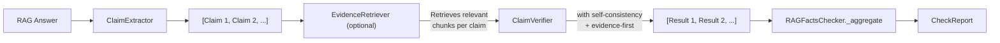

# Data Flow

## Pipeline Overview

## Step-by-Step

### 1. Claim Extraction

The answer text is sent to the LLM with a claim extraction prompt. The LLM returns a structured list of atomic factual claims. Each claim is parsed into a `Claim` object with:

- `index` — position in the extracted list
- `text` — the claim string
- `span` — `{start, end}` character offsets in the original answer

### 2. Evidence Retrieval (optional)

If `use_evidence_retrieval=True`, the `EvidenceRetriever` splits all source documents into chunks and retrieves the top-k most relevant chunks for each claim using lexical matching. This reduces context window usage and improves verification accuracy.

### 3. Claim Verification

Each claim is verified against the source documents (or retrieved chunks). For each claim:

- The LLM is prompted with the claim + relevant document text
- If `evidence_first=True`, the prompt uses a multi-step format (extract evidence → compare → verdict → output)
- If `num_consistency_runs > 1`, verification runs multiple times with increasing temperatures and results are aggregated via majority vote
- Output is parsed into a `VerificationResult` with verdict, confidence, evidence, explanation, and optional `consistency_score`

### 4. Aggregation

`RAGFactsChecker._aggregate` combines all `VerificationResult` objects into a single `CheckReport`:

- **`overall_confidence`** — weighted average of per-claim confidence scores
- **`overall_verdict`** — derived from the distribution of per-claim verdicts
- **`dimensions`** — groundedness, contradiction rate, hallucination rate, completeness
- **`hallucination_flags`** — claims that are contradicted or lack evidence
- **`summary`** — human-readable summary text

See [Output Format](output-format.md) for the full `CheckReport` schema.
