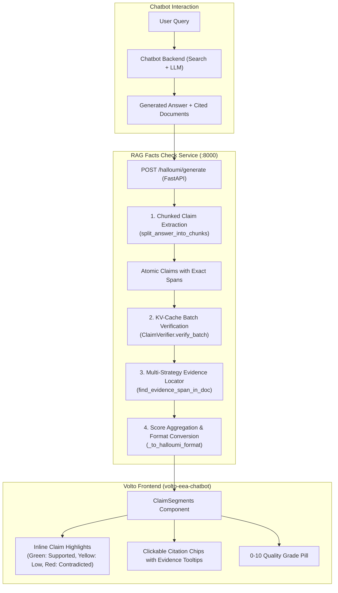
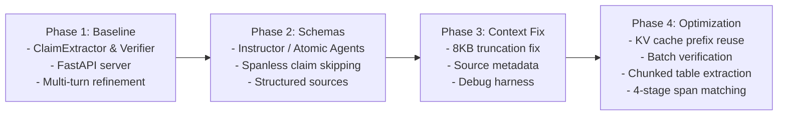

# Project Overview

**RAG Facts Check** is a standalone, claim-level fact-checking and verification service designed for Retrieval-Augmented Generation (RAG) applications, primarily serving the **European Environment Agency (EEA) Climate-ADAPT Chatbot**.

It provides fine-grained verification of generated text against source documents, highlights verified or hallucinated claim segments in the UI, and grades overall response reliability on an interpretable 0–10 scale.

---

## High-Level System Architecture



---

## The Problem: Hallucinations in RAG

In complex RAG applications like environmental policy chatbots:
- **Subtle inaccuracies**: The LLM may hallucinate specific figures (e.g. citing 5.7°C instead of 2.0–4.0°C), misattribute policy milestones (e.g. claiming 2035 instead of 2050), or cite outdated legislation.
- **Long structured responses**: Responses frequently contain markdown tables, bulleted action lists, and multi-paragraph conclusions. Standard extraction prompts hit generation limits and cut off verification halfway through the answer.
- **Disconnection from sources**: Scraped web pages and PDF extracts have irregular whitespace and formatting, causing naive string-matching to fail when locating citations.

RAG Facts Check solves these problems with an end-to-end verification and alignment pipeline.

---

## Four Core Pillars

### 1. Chunked Claim Extraction
- Decomposes long answers (>2,000 chars) into semantic chunks before prompting the LLM.
- Keeps markdown comparison tables intact, or splits large tables row-by-row while **replicating the header row** into every chunk.
- Guarantees 100% text coverage across large tables and concluding sections without token-limit truncations.

### 2. Multi-Strategy Evidence Span Matching
- Web documents and PDFs contain hard line breaks, hyphenation, and OCR artifacts.
- When the LLM quotes evidence, `find_evidence_span_in_doc()` matches quotes through a 4-stage hierarchy:
  1. Straight/smart quote and ellipsis stripping
  2. Exact substring search
  3. Whitespace-flexible regex (`\s+`) across line breaks
  4. Punctuation-tolerant regex (`[\W_]+`)
  5. Fuzzy sequence alignment fallback

### 3. KV-Cache Batch Verification
- Claims are verified in configurable batches (default: 20 claims per request).
- Source documents are placed at the beginning of the prompt, enabling `llama.cpp` and `vLLM` to reuse pre-computed KV cache prefixes.
- Preserves `document_index` directly from LLM output to attribute evidence to the exact source document.

### 4. Calibrated 0–10 Answer Quality Score
- Translates verification verdicts into a calibrated 0–10 score:
  - **Supported claims**: weight $1.0$
  - **Not enough info**: weight $0.4$
  - **Contradicted claims**: weight $0.0$
- Applies proportional penalties for missing citations on supported claims and severe penalties for contradictions.
- Maps scores to intuitive qualitative grades (`Excellent`, `Good`, `Acceptable`, `Poor`, `Failing`).

---

## Architectural Evolution



| Phase | Key Milestone | Problem Solved |
|---|---|---|
| **Phase 1** (Jul 2026) | Initial extraction & verification engine | Baseline fact-checking pipeline |
| **Phase 2** (Jul 2026) | Structured schemas & span offsets | Eliminates frontend text duplication bugs |
| **Phase 3** (Aug 2026) | Context limit removal | Fixed silent 8KB source truncation bug |
| **Phase 4** (Aug–Sep 2026) | Batching, chunking & robust spans | Solved long table cutoffs, missing evidence segments, and latency |

---

## Quick Start

### Installation

```bash
git clone git@github.com:eea/rag-facts-check.git
cd rag-facts-check

python3 -m venv .venv
source .venv/bin/activate
pip install -e ".[test,dev,server]"
```

### Running Locally

```bash
# Start development server with auto-reload
make serve

# Or run directly via uvicorn
uvicorn rag_facts_check.server:app --reload --host 0.0.0.0 --port 8000
```

### Production Docker

```bash
docker build -t rag-fact-check .
docker run -p 8000:8000 -e LLM_API_BASE=http://host.docker.internal:4002/v1 rag-fact-check
```

---

## Documentation Navigation

- **[System Architecture](/architecture/architecture.md)** — Detailed module layout and component responsibilities
- **[Data Flow and Lifecycle](/architecture/data-flow.md)** — Sequence diagrams, context selection, and coordinate mapping
- **[Answer Quality Score](/architecture/answer-quality-score.md)** — Scoring algorithm and weight calibration
- **[Output Format](/architecture/output-format.md)** — Schemas for `CheckReport` and Halloumi responses
- **[Web Service Guide](/guides/web-service.md)** — Endpoints and request/response specifications
- **[Testing Guide](/guides/testing.md)** — Test suite overview and mocking fixtures
