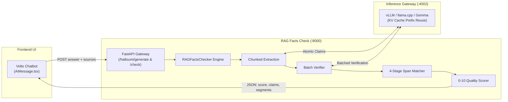

# Presentation Deck: RAG Facts Check

> **Target Duration:** 10 minutes (~8–9 minutes spoken + 1–2 minutes Q&A)  
> **Speaker Pace:** ~110–130 words per minute  
> **Audience:** Technical leads, AI engineers, and product stakeholders  
> **Software Repository:** [RAG Facts Check](file:///home/tibi/work/rag-fact-check/README.md)

---

## Slide 1: Title & Hook

**Time Allocation:** 0:00 – 1:00 (1 minute)

### Slide Visual & Layout
```
+-------------------------------------------------------------------------------+
|  RAG Facts Check                                                              |
|  Automated, Claim-Level Verification for Enterprise RAG                       |
|                                                                               |
|  [ EEA & Climate-ADAPT Logos ]                                                |
|                                                                               |
|  • Restoring User Trust in Generative Environmental Policy Answers            |
|  • Sub-Sentence Claim Extraction & Evidence Grounding                         |
|  • Seamless Volto Frontend Integration & Calibrated 0–10 Scoring              |
|                                                                               |
|  Presenter: [Your Name]                                                       |
|  Project: European Environment Agency (EEA) / Plone Chatbot                   |
+-------------------------------------------------------------------------------+
```

### Slide Content (Bullet Points)
* **Mission:** Automated fact-checking and hallucination elimination for RAG systems.
* **Context:** Built for the European Environment Agency (EEA) Climate-ADAPT Chatbot.
* **Core Value:** Replaces blind model faith with sub-sentence verification, verbatim source attribution, and an interpretable 0–10 trust score.
* **Integration:** Drop-in replacement for legacy Halloumi middleware in `volto-eea-chatbot`.

### Verbatim Speaker Script
> "Good morning, everyone. Today I am presenting **RAG Facts Check**, a verification engine built to address one of the most critical challenges in generative AI: making Retrieval-Augmented Generation trustworthy and auditable.
>
> In enterprise domains—specifically within the European Environment Agency’s Climate-ADAPT chatbot—answers generated by LLMs influence policy research, regional adaptation decisions, and public understanding. Simply pointing users to a list of source links isn't enough; users need to know which specific statements are backed by official facts, and which are not.
>
> Over the next ten minutes, I'll walk you through how RAG Facts Check solves the technical bottlenecks of hallucination detection, how our pipeline extracts and validates claims in seconds, and how it delivers transparent visual verification directly to the user."

**Transition:** *"To understand why we built this system, let's first examine where traditional RAG verification falls short."*

---

## Slide 2: The Problem — The Enterprise RAG "Trust Gap"

**Time Allocation:** 1:00 – 2:15 (1 minute 15 seconds)

### Slide Visual & Layout
```
+-------------------------------------------------------------------------------+
|  The Challenge: Why Naive RAG Verification Fails                              |
|                                                                               |
|  [ 1. Subtle Hallucinations ]     [ 2. The Truncation Wall ]   [ 3. Messy Scraping ]  |
|  • Small date/stat shifts         • Markdown comparison        • Linebreaks, smart    |
|  • Target: 2050 -> 2035             tables cut off output        quotes, OCR shifts   |
|  • Temp: 2-4°C -> 5.7°C           • LLMs drop last sections    • Exact match fails    |
|                                                                               |
|  Result: Enterprise answers lose credibility without granular evidence        |
+-------------------------------------------------------------------------------+
```

### Slide Content (Bullet Points)
* **Subtle, High-Impact Hallucinations:** Real-world RAG models rarely produce obvious gibberish; instead, they shift crucial dates, switch target baselines, or misattribute policy milestones.
* **The Token Generation Limit:** Long answers (>2,000 characters) and markdown tables with 8+ rows exceed LLM output token budgets during one-pass extraction, truncating verification.
* **Unstructured Source Disconnect:** Government PDFs and scraped HTML contain hard linebreaks, hyphenation, and irregular whitespace. Naive string matching cannot locate the quotes generated by the LLM.
* **Latency Overhead:** Checking 15–30 claims sequentially against extensive documents causes intolerable latency in real-time chat.

### Verbatim Speaker Script
> "Standard RAG is great at finding relevant documents, but the generation step remains a black box. In policy and regulatory contexts, hallucinations are rarely obvious nonsense. They are subtle: an LLM might say a net-zero milestone is legally binding by 2035 instead of 2050, or quote a temperature rise of 5.7°C instead of 2.0 to 4.0°C. That single discrepancy undermines the entire platform's credibility.
>
> When teams try to build verification for this, they hit three practical walls:
> First, long answers—especially rich markdown tables comparing climate impacts across sectors—routinely hit model output token ceilings, cutting verification off halfway through the response.
> Second, source documents scraped from official portals have erratic formatting, linebreaks, and OCR noise, causing exact string matching to fail completely.
> And third, calling an LLM sequentially for dozens of individual claims takes 45 to 60 seconds, which kills interactive chat UX.
>
> We designed RAG Facts Check specifically to overcome every single one of these production hurdles."

**Transition:** *"Let's look at the end-to-end architecture that makes this work seamlessly in real time."*

---

## Slide 3: Solution & System Architecture

**Time Allocation:** 2:15 – 3:30 (1 minute 15 seconds)

### Slide Visual & Layout
A high-level architecture diagram showing the relationship between Volto, Plone, the fact-checking service, and the LLM gateway.



### Slide Content (Bullet Points)
* **Architecture Role:** High-performance verification layer positioned between the chatbot generation backend and the frontend interface.
* **Dual Endpoint Exposure:**
  * `POST /check`: Full analytical audit returning dimension scores, hallucination flags, and raw claims.
  * `POST /halloumi/generate`: Drop-in replacement for the EEA Volto chatbot frontend.
* **Core Pipeline Stages:**
  1. Semantic Chunking ([`split_answer_into_chunks`](file:///home/tibi/work/rag-fact-check/rag_facts_check/checker.py#L43))
  2. Multi-chunk Claim Extraction ([`ClaimExtractor`](file:///home/tibi/work/rag-fact-check/rag_facts_check/checker.py#L153))
  3. KV-Cache Batch Verification ([`ClaimVerifier`](file:///home/tibi/work/rag-fact-check/rag_facts_check/checker.py#L422))
  4. Multi-Strategy Evidence Locator ([`find_evidence_span_in_doc`](file:///home/tibi/work/rag-fact-check/rag_facts_check/spans.py#L83))
  5. Calibrated Scoring & Halloumi Mapping ([`_to_halloumi_format`](file:///home/tibi/work/rag-fact-check/rag_facts_check/server.py#L362))

### Verbatim Speaker Script
> "Here is the architectural blueprint. RAG Facts Check runs as a lightweight, containerized FastAPI service. In our deployment with the European Environment Agency, Plone and the LLM generate the answer along with cited sources.
>
> Immediately after generation, the Volto frontend issues an asynchronous request to our `/halloumi/generate` endpoint.
>
> Inside the engine, the request flows through four modular stages managed by [`RAGFactsChecker`](file:///home/tibi/work/rag-fact-check/rag_facts_check/checker.py#L893):
> First, the answer text is chunked without destroying table formatting.
> Second, atomic claims are extracted with character offsets mapped to the master answer.
> Third, the claims are batched and verified against the source documents in a single pass.
> Fourth, verbatim evidence quotes are resolved into exact character spans in the original source texts.
> Finally, a calibrated 0-to-10 score is computed, and the payload is returned to the frontend.
>
> Let's look closer at how we solved the long-answer truncation problem in step one."

**Transition:** *"Extracting claims from dense tables and multi-paragraph answers requires structural awareness."*

---

## Slide 4: Innovation 1 — Chunked Claim Extraction & Table Preservation

**Time Allocation:** 3:30 – 4:45 (1 minute 15 seconds)

### Slide Visual & Layout
```
+-------------------------------------------------------------------------------+
|  Challenge: Long Markdown Tables Cut Off Output Tokens                        |
|                                                                               |
|  [ Original Large Table ]                                                     |
|  | Sector | 2030 Goal | Status |   <-- Header Row                             |
|  | Energy | -55%      | Active |                                              |
|  | Transp | -90%      | Draft  |   ==> split_answer_into_chunks()             |
|  | Agric. | -30%      | Review |                                              |
|                                                                               |
|  [ Chunk 1: <= 2000 chars ]             [ Chunk 2: <= 2000 chars ]            |
|  | Sector | 2030 Goal | Status |        | Sector | 2030 Goal | Status | (Replicated!)|
|  | Energy | -55%      | Active |        | Agric. | -30%      | Review |             |
|  | Transp | -90%      | Draft  |                                              |
|                                                                               |
|  Outcome: 100% table row verification with zero lost context or truncation    |
+-------------------------------------------------------------------------------+
```

### Slide Content (Bullet Points)
* **The Problem:** Single-pass claim extraction on long answers (>2,500 characters) cuts off mid-answer due to token generation limits (`max_new_tokens = 2048`).
* **Header-Replicating Splitter:** [`split_answer_into_chunks`](file:///home/tibi/work/rag-fact-check/rag_facts_check/checker.py#L43) detects markdown tables and splits rows across chunks while **re-injecting table headers into every split chunk**.
* **Short Section Merging:** Small headings and lead paragraphs are merged into coherent semantic chunks.
* **Coordinate Recalibration:** Each chunk tracks its offset relative to the master text. Extracted claim spans are mapped back to absolute answer offsets:
  $$\text{master\_start} = \text{offset} + \text{local\_start}$$
* **Span Deduplication:** Identical claim spans extracted across chunk boundaries are deduplicated and re-indexed.

### Verbatim Speaker Script
> "One of our earliest discoveries was that chatbot answers frequently include markdown comparison tables. If you send an 8-row table to an LLM extractor in one prompt, the model runs out of output tokens before it reaches the summary at the bottom. The table is only half-checked, and concluding recommendations aren't checked at all.
>
> If you naively slice a markdown table by character count, the second chunk loses the header row, meaning the LLM has no idea what column a cell belongs to.
>
> Our solution, implemented in [`split_answer_into_chunks`](file:///home/tibi/work/rag-fact-check/rag_facts_check/checker.py#L43), parses markdown table structures. When a table must be split, it preserves row integrity and automatically duplicates the header row into subsequent chunks.
>
> We then recalibrate the character offsets back into the master answer coordinates and deduplicate overlapping claims. This gives us 100% extraction coverage on long, structured policy responses."

**Transition:** *"Once we have the claims extracted, how do we verify them against large documents without stalling user response time?"*

---

## Slide 5: Innovation 2 — High-Throughput Batch Verification & KV-Cache Reuse

**Time Allocation:** 4:45 – 6:00 (1 minute 15 seconds)

### Slide Visual & Layout
```
+-------------------------------------------------------------------------------+
|  KV-Cache Prefix Reuse: Slashing Verification Latency                         |
|                                                                               |
|  Prompt Layout:                                                               |
|  [ STATIC PREFIX: Source Documents (8–30 KB) ]  <-- CACHED IN GPU MEMORY      |
|  [ DYNAMIC SUFFIX: Batch of Claims 1..20 ]      <-- Only tokens processed     |
|                                                                               |
|  Sequential Verification: 20 LLM Calls = ~45–60s Latency (Unusable)           |
|  KV-Cache Batch Verification: 1 Batched LLM Call = ~5–12s Latency (Production)|
|                                                                               |
|  • Context Selection: 'citations' mode filters payload to cited docs only     |
|  • Backend Compatibility: Optimized for vLLM, llama.cpp, and LiteLLM gateways |
+-------------------------------------------------------------------------------+
```

### Slide Content (Bullet Points)
* **The Latency Trap:** Running claim-by-claim verification serially against 30KB of source documents causes extreme latency (45–60s+).
* **Batch Verification:** [`ClaimVerifier.verify_batch`](file:///home/tibi/work/rag-fact-check/rag_facts_check/checker.py#L732) groups claims into configurable batches (default: 20 claims per request).
* **Static Prefix Ordering:** Prompts are structured with source documents placed strictly at the beginning, followed by indexed claims:
  - Document tokens are computed once.
  - Engines like `vLLM` and `llama.cpp` reuse pre-computed KV-cache prefixes across batches.
* **Targeted Source Context:** Volto supports `qualityCheckContext = 'citations'`, passing only documents cited in the answer (2–4 docs) rather than the entire raw retrieval dump (15–50 docs), dropping prefill latency by over 70%.

### Verbatim Speaker Script
> "Verification latency is make-or-break for a chatbot. If a user has to wait a minute for verification highlights, they will navigate away.
>
> In [`ClaimVerifier`](file:///home/tibi/work/rag-fact-check/rag_facts_check/checker.py#L422), we solve this with two key techniques:
>
> First, batching. Rather than firing one LLM call per claim, we evaluate batches of up to 20 claims simultaneously.
> Second, prompt architecture designed for KV-cache prefix reuse. We place the static reference documents at the beginning of the prompt. Modern inference engines like vLLM and llama.cpp recognize that this prefix hasn't changed, so GPU memory reuses the pre-computed key-value cache rather than re-ingesting tens of thousands of document tokens.
>
> In addition, our frontend passes only the documents explicitly cited in the answer rather than the full set of 50 search chunks. Together, these optimizations drop verification latency from over 45 seconds down to 5 to 12 seconds."

**Transition:** *"When the LLM finds evidence in a document, how do we reliably highlight that evidence for the user?"*

---

## Slide 6: Innovation 3 — 4-Stage Resilient Evidence Span Matching

**Time Allocation:** 6:00 – 7:15 (1 minute 15 seconds)

### Slide Visual & Layout
```
+-------------------------------------------------------------------------------+
|  Multi-Strategy Evidence Locator (spans.py)                                   |
|                                                                               |
|  LLM Quote: “The European Climate Law sets a net-zero target by 2050...”      |
|                                                                               |
|  Stage 1: Strip quotes & ellipses       ->  Clean text                        |
|  Stage 2: Exact substring match         ->  Direct hit (fastest)              |
|  Stage 3: Whitespace regex (\s+)        ->  Matches across linebreaks (\n)    |
|  Stage 4: Boundary regex ([\W_]+)       ->  Tolerates hyphens & OCR artifacts |
|  Stage 5: Fuzzy SequenceMatcher         ->  Handles minor LLM paraphrasing    |
|                                                                               |
|  Output: Exact character offset {startOffset: 1420, endOffset: 1485}          |
+-------------------------------------------------------------------------------+
```

### Slide Content (Bullet Points)
* **The Real-World Reality:** Web scrapes and PDF extracts contain hard breaks, hyphenated words across lines, and irregular whitespace.
* **The LLM Quotation Problem:** Models frequently add decorative quotation marks (`"`, `'`, `“`, `”`), trailing ellipses (`...`), or slight paraphrasing when citing source evidence.
* **Resilient Hierarchy in [`find_evidence_span_in_doc`](file:///home/tibi/work/rag-fact-check/rag_facts_check/spans.py#L83):**
  1. **Quote & Ellipsis Stripping:** Sanitizes outer punctuation.
  2. **Exact Match:** Direct character search for clean quotes.
  3. **Whitespace-Flexible Regex (`\s+`):** Bridges quotes spanning line breaks and tabs.
  4. **Punctuation & Word-Boundary Regex (`[\W_]+`):** Matches across hyphenation and OCR shifts.
  5. **Fuzzy Fallback (`SequenceMatcher`):** High-confidence alignment for minor word variations.
* **Result:** Precise `{start, end}` character offsets in source documents for instant UI tooltip highlighting.

### Verbatim Speaker Script
> "Once the model identifies evidence, it cites a verbatim snippet. But anyone who has worked with real document pipelines knows what happens next: string matching fails.
>
> Official documents converted from PDF or HTML are full of hard newlines, soft hyphens, and weird spaces. Furthermore, LLMs love adding smart quotes or ellipses to their evidence citations.
>
> To ensure citations never break, we developed a 4-stage matching hierarchy in [`find_evidence_span_in_doc`](file:///home/tibi/work/rag-fact-check/rag_facts_check/spans.py#L83).
> It first strips framing quotes and ellipses. It tries an exact match. If that fails, it compiles a whitespace-flexible regular expression that treats line breaks and multiple spaces as single wildcards. If that fails, it allows punctuation variations. And as a final safety net, it uses fuzzy sequence alignment.
>
> This guarantees that whenever the LLM cites true source evidence, we resolve the exact character coordinates in the original document so the user can inspect it."

**Transition:** *"Now, how do all these granular verdicts translate into a simple, intuitive user experience?"*

---

## Slide 7: Calibrated Quality Scoring & Frontend User Experience

**Time Allocation:** 7:15 – 8:30 (1 minute 15 seconds)

### Slide Visual & Layout
A mockup of the Volto Chatbot UI showing inline claim highlights, evidence tooltips, and the 0–10 score pill.

```
+-------------------------------------------------------------------------------+
|  Volto Frontend UI (volto-eea-chatbot)                                        |
|                                                                               |
|  [ Answer Quality: 8.5 / 10 (Good) ]                                          |
|                                                                               |
|  The European Climate Law sets a legally binding net-zero target by 2050. [1] |
|  ~~~~~~~~~~~~~~~~~~~~~~~~~~~~~~~~~~~~~~~~~~~~~~~~~~~~~~~~~~~~~~~~~~~~~~~~~    |
|  [🟢 Supported | Confidence: 95%]                                             |
|  [Source Quote: "achieve climate neutrality across the Union by 2050"]        |
|                                                                               |
|  Member states must submit preliminary drafts by December 2024. [2]           |
|  ~~~~~~~~~~~~~~~~~~~~~~~~~~~~~~~~~~~~~~~~~~~~~~~~~~~~~~~~~~~~~~~~             |
|  [🟡 Low Confidence / Not Enough Info]                                        |
|                                                                               |
|  Score Formula: Base Groundedness  x  Citation Penalty  x  Contradiction Pen. |
+-------------------------------------------------------------------------------+
```

### Slide Content (Bullet Points)
* **Deterministic Scoring Formula** (computed without extra LLM overhead):
  $$\text{Score} = \text{round}\Big(\text{clamp}\big(\text{Groundedness} \times \text{Citation Penalty} \times \text{Contradiction Penalty},\, 0,\, 10\big),\, 1\Big)$$
  * **Groundedness:** Supported claims = $1.0$, Unverified = $0.4$, Contradicted = $0.0$.
  * **Citation Penalty:** Up to 30% reduction if supported claims fail to cite source text.
  * **Contradiction Penalty:** Severe multiplier; 33%+ contradicted claims floors score to 0.
* **Qualitative Score Tiers ([`score_label`](file:///home/tibi/work/rag-fact-check/rag_facts_check/models.py#L10)):**  
  *9–10: Excellent* | *7–8: Good* | *5–6: Acceptable* | *3–4: Poor* | *1–2: Failing*
* **Frontend Experience:**
  * 🟢 **Green highlight:** Verified statement with hoverable source quote tooltip.
  * 🟡 **Yellow highlight:** Unverified or low-confidence claim.
  * 🔴 **Red highlight:** Direct contradiction with source documentation.

### Verbatim Speaker Script
> "Users do not want an opaque 'Pass' or 'Fail'. They need calibrated, actionable transparency.
>
> In [`models.py`](file:///home/tibi/work/rag-fact-check/rag_facts_check/models.py) and [`checker.py`](file:///home/tibi/work/rag-fact-check/rag_facts_check/checker.py), we compute a deterministic 0-to-10 Answer Quality Score. Supported claims earn full credit, uncited claims receive a proportional penalty, and direct contradictions hit the score with a heavy penalty multiplier.
>
> In the Volto user interface, this translates into immediate visual clarity:
> An overall score badge—like '8.5 / 10 Good'—sits at the top.
> Every sentence in the answer is highlighted. Green means fully verified, and hovering over it reveals the exact quote from the European legislation. Yellow alerts the user that a claim lacks direct source backing, and red immediately flags a contradiction.
>
> This shifts the user dynamic from blind skepticism to confident, auditable reading."

**Transition:** *"Behind this user experience is a production-hardened engineering foundation."*

---

## Slide 8: Production Readiness & Engineering Rigor

**Time Allocation:** 8:30 – 9:15 (45 seconds)

### Slide Visual & Layout
```
+-------------------------------------------------------------------------------+
|  Production-Ready Engineering Standards                                       |
|                                                                               |
|  [ 190 Tests Passing (100%) ]      [ Standardized Schemas ]   [ Containerized ]|
|  • 87% coverage on checker.py      • Pydantic + Instructor    • Multi-stage    |
|  • 88% coverage on spans.py        • Zero schema drift          Dockerfile     |
|  • 95% coverage on retriever.py    • Type-checked outputs     • CI/CD pipeline |
|                                                                               |
|  Drop-In Replacement:                                                         |
|  Native /halloumi/generate compatibility requires zero frontend code changes. |
+-------------------------------------------------------------------------------+
```

### Slide Content (Bullet Points)
* **Zero-Friction Integration:** Full schema compatibility with legacy Halloumi endpoints ([`_to_halloumi_format`](file:///home/tibi/work/rag-fact-check/rag_facts_check/server.py#L362)); frontends switch by updating a single URL.
* **Structured Generation:** Uses **Pydantic**, **Instructor**, and **Atomic Agents** to guarantee deterministic JSON output from LLMs.
* **Extensive Test Coverage:**
  * 190 automated unit and integration tests (100% pass rate).
  * 87% coverage on [`checker.py`](file:///home/tibi/work/rag-fact-check/rag_facts_check/checker.py), 88% on [`spans.py`](file:///home/tibi/work/rag-fact-check/rag_facts_check/spans.py), 95% on [`retriever.py`](file:///home/tibi/work/rag-fact-check/rag_facts_check/retriever.py), 100% on [`models.py`](file:///home/tibi/work/rag-fact-check/rag_facts_check/models.py).
* **Enterprise Packaging:** Automated Jenkins CI/CD pipeline, Docker container, and standard `.env` configuration.

### Verbatim Speaker Script
> "RAG Facts Check is not a prototype; it is engineered for production reliability.
>
> Because it provides native `/halloumi/generate` endpoint compatibility, the frontend team didn't need to rebuild their UI. They simply pointed their proxy to our service.
>
> Every LLM response is enforced via structured Pydantic schemas using Instructor, eliminating JSON parsing errors. The codebase is backed by 190 automated tests with over 87% core module coverage, verifying everything from table splitting edge cases to regex span tolerance. It builds into a clean Docker container deployable in any Kubernetes or cloud environment."

**Transition:** *"Let's summarize our core takeaways and look at what is coming next."*

---

## Slide 9: Summary, Roadmap & Q&A

**Time Allocation:** 9:15 – 10:00 (45 seconds + Q&A)

### Slide Visual & Layout
```
+-------------------------------------------------------------------------------+
|  Summary & Future Roadmap                                                     |
|                                                                               |
|  Key Achievements:                                                            |
|  ✔ Solved markdown table truncation via header-replicated chunking            |
|  ✔ Slashed verification latency via KV-cache prefix batching                  |
|  ✔ Resilient evidence attribution across real-world messy documents           |
|  ✔ Calibrated 0–10 score with interactive Volto inline highlights             |
|                                                                               |
|  What's Next:                                                                 |
|  • Specialized lightweight NLI models for sub-second claim classification     |
|  • Cross-document contradiction detection                                     |
|                                                                               |
|  Questions & Discussion                                                       |
+-------------------------------------------------------------------------------+
```

### Slide Content (Bullet Points)
* **Key Takeaways:**
  1. Granular claim-level verification transforms generative AI into an auditable tool.
  2. Structural chunking and 4-stage span matching solve real-world markdown and scraping hurdles.
  3. KV-cache batch verification makes thorough verification viable in live chat.
* **Roadmap:**
  * Integration of specialized Natural Language Inference (NLI) models for sub-second verification.
  * Cross-document contradiction and consensus analysis.
* **Open Discussion:** Thank you! Questions & answers.

### Verbatim Speaker Script
> "To wrap up: RAG Facts Check bridges the trust gap in enterprise RAG. By pairing markdown-aware claim extraction with KV-cache batching and 4-stage span matching, we've delivered a fact-checking pipeline that is accurate, resilient to noisy data, and fast enough for interactive use.
>
> Looking ahead, we are exploring dedicated local NLI models to push verification latencies even lower, as well as cross-document consensus checking.
>
> Thank you for your time, and I look forward to your questions."

---

## Speaker Delivery Cheatsheet

| Time Stamp | Current Slide | Key Checkpoint |
|---|---|---|
| **0:00** | Slide 1: Hook | Set the tone: High stakes in environmental policy. |
| **1:00** | Slide 2: Problem | Highlight the 3 walls: subtle errors, table limits, messy docs. |
| **2:15** | Slide 3: Architecture | Walk through the sequence: UI $\rightarrow$ Checker $\rightarrow$ LLM $\rightarrow$ UI. |
| **3:30** | Slide 4: Chunking | Emphasize **table header replication** (key innovation). |
| **4:45** | Slide 5: Batching | Emphasize **KV-cache prefix reuse** and 70% latency drop. |
| **6:00** | Slide 6: Spans | Walk down the 4-stage hierarchy: quote strip $\rightarrow$ regex $\rightarrow$ fuzzy. |
| **7:15** | Slide 7: Scoring & UX | Point out the 0–10 formula and green/yellow/red highlights. |
| **8:30** | Slide 8: Production | Highlight 190 tests, 100% pass rate, drop-in Halloumi API. |
| **9:15** | Slide 9: Q&A | Close cleanly and invite discussion. |

---

## Anticipated Audience Questions & Quick Answers

1. **Q: Why not just use a single prompt asking the LLM 'Is this entire answer accurate?'**  
   *A:* Single-prompt checks cannot highlight specific sentences in the UI, frequently suffer from confirmation bias, and cannot cite exact character offsets in source documents. Claim-level extraction is essential for granular user auditing.
2. **Q: How does the system handle tables with 20 or 30 rows?**  
   *A:* [`split_answer_into_chunks`](file:///home/tibi/work/rag-fact-check/rag_facts_check/checker.py#L43) splits tables row-by-row while copying the table header row into every chunk. Every row is evaluated with its correct column headers, and offsets are translated back to the master table.
3. **Q: What happens if an evidence quote is slightly paraphrased by the LLM?**  
   *A:* Stage 5 of [`find_evidence_span_in_doc`](file:///home/tibi/work/rag-fact-check/rag_facts_check/spans.py#L83) falls back to `difflib.SequenceMatcher` fuzzy alignment. If the semantic similarity exceeds the threshold, it matches the closest corresponding span.
4. **Q: What LLM backend is required?**  
   *A:* The service is model-agnostic via standard OpenAI-compatible endpoints (LiteLLM, vLLM, Ollama, or llama.cpp). It works out of the box with models like Gemma, Llama, and Mistral.
