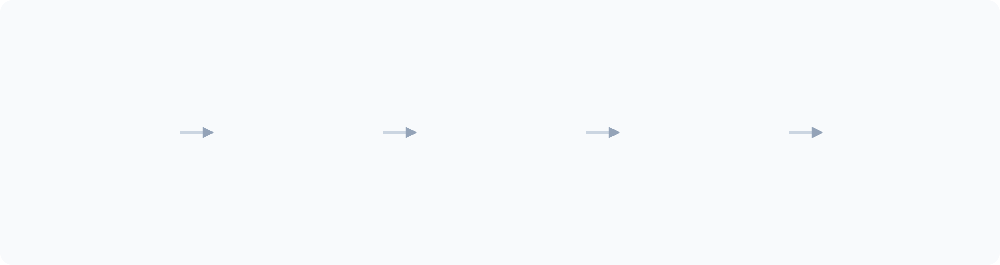

## 1. How It Works: Verification Pipeline



::::: columns
::: {.column width="33%"}
### 1. Table-Aware Chunking
- Splits long responses & tables row-by-row.
- **Replicates table headers** into every chunk so column context is never lost.
:::
::: {.column width="33%"}
### 2. KV-Cache Batching
- Verifies up to 20 claims simultaneously.
- **Static document prefix** reuses KV-cache in `vLLM` / `llama.cpp` (>70% faster).
:::
::: {.column width="33%"}
### 3. Resilient Span Locator
- 4-stage hierarchy: quote strip $\rightarrow$ exact $\rightarrow$ `\s+` regex $\rightarrow$ fuzzy.
- Resolves exact offsets despite PDF line breaks.
:::
:::::

::: notes
When our chatbot generates an answer from European environmental documents, RAG Facts Check audits every single sentence in real time.

Instead of treating the answer as one opaque block, our pipeline:
1. Decomposes the answer into atomic claims. If there's an 8-row comparison table, it preserves row integrity and duplicates the header row across chunks so no column context is lost.
2. Batches claims together and places static source documents at the beginning of the prompt. Modern engines like vLLM and llama.cpp reuse the pre-computed KV-cache prefix, dropping verification latency down to 5 to 12 seconds.
3. Maps model evidence quotes back to exact character offsets in the original documents using a 4-stage locator that tolerates OCR artifacts, linebreaks, and smart quotes.
:::

## 2. User Experience: Calibrated Scoring & Inline Verification

::::: columns
::: {.column width="48%"}
### Calibrated 0–10 Trust Score
$$\text{Score} = \text{clamp}(\text{Base} \times P_{\text{cite}} \times P_{\text{contra}},\, 0,\, 10)$$

* **Deterministic Formula:** Computed instantly without extra LLM overhead.
* **Tiered Confidence:**
  * 🟢 **Green (Supported):** Full credit; hoverable tooltip displays source quote.
  * 🟡 **Yellow (Low Confidence):** Unverified claim; warns the user.
  * 🔴 **Red (Contradicted):** Harsh penalty; alerts user to factual error.
* **Drop-in Middleware:**
  * Native `/halloumi/generate` endpoint requires zero frontend code changes in Volto.
:::
::: {.column width="52%"}
### [ Insert UI Screenshot Here ]

```
+-------------------------------------------------------------+
|  Volto Chatbot UI (volto-eea-chatbot)                       |
|                                                             |
|  [ Score Pill: 8.5 / 10 (Good) ]                            |
|                                                             |
|  The European Climate Law sets a binding net-zero           |
|  target by 2050. [1]  <-- [🟢 Supported | Hover: Quote]     |
|                                                             |
|  Member states must submit reports by Dec 2024. [2]         |
|  <-- [🟡 Low Confidence / Not Enough Info]                  |
+-------------------------------------------------------------+
```
*(Drop in your actual Volto screenshot above this box)*
:::
:::::

::: notes
For the user, this turns a black-box AI response into an auditable, transparent document.

At the top, users see a calibrated 0-to-10 quality badge, like '8.5 / 10 Good'.

Every sentence in the text is color-coded. Fully supported claims are highlighted in green, and clicking or hovering on them immediately reveals the exact quoted passage from official European legislation. If a claim relies on ungrounded model knowledge or lacks source evidence, it is flagged in yellow; and if the model contradicts the source, it is flagged in red.

Because our backend directly satisfies the Halloumi endpoint contract, this integration is live today with zero modifications to the Volto frontend code.
:::
